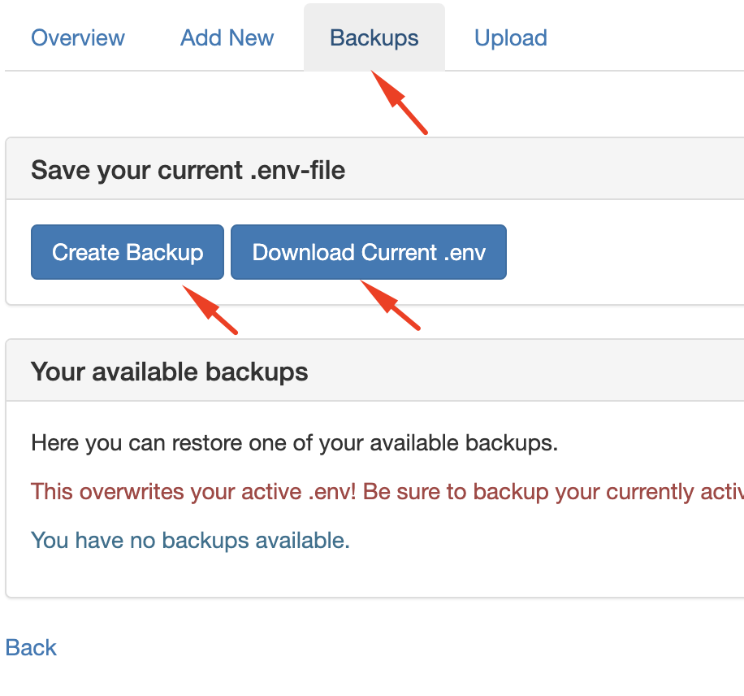
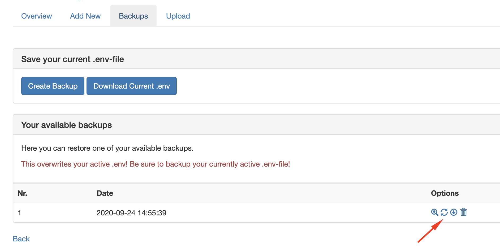

# Updating - Shared hosting

## 1. If you have made any changes on the code

In case, you have made any changes on the code, css or js file. Backup them first so you don't lose your work. Download them or take a note what you have changed.

### 2. Backup this files and folder is case something goes wrong

* [ ] public/uploads  \( you can zip it and move it somewhere \)

#### Backup .env \( required to be backed up \)

Login as admin, and there, go to the "ENV Editor" and select the "Backup" tab as displayed on the image. 

### 3. Download the code from CodeCanyon and upload the zip

Download the code from CodeCanyon and directly upload it on your hosting, in the same place where your existing site is.

### 4. Extract the zip file

Extract the zip files. Overwriting old files.

### **5. Restore your .env file**

Go once again in ENV editor, and in the backup tab, restore your .env file

### 6. After files are moved, open yourdomain.com/update

Here, if there are migrations for the database to be done, will be run. If there is nothing to be done you will get 404 site.

### 7. See the change log and Environment variables to see what new features are added and how to enable them.



