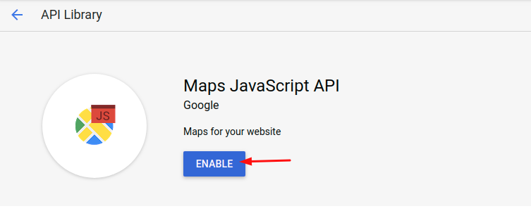
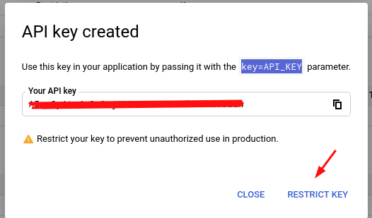
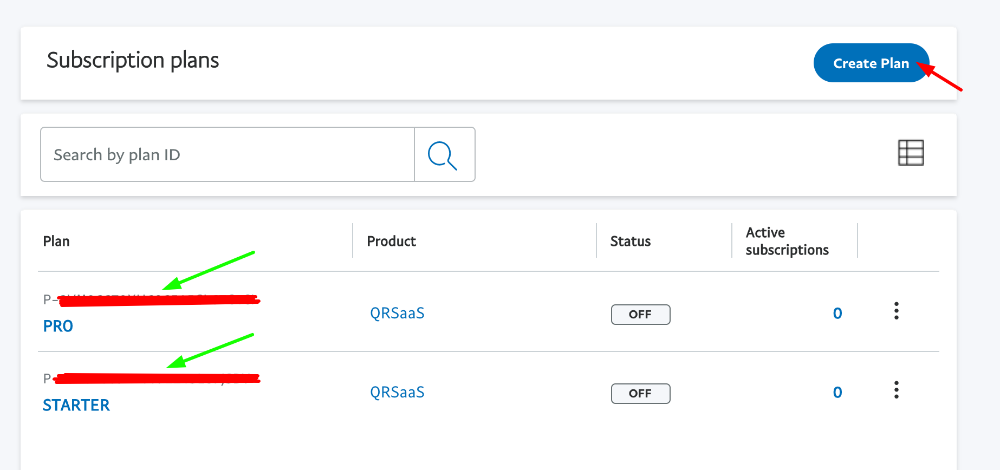

# Google Map API

## Make a Google Project and enable APIs

To use the Maps JavaScript you must have an API key. The API key is a unique identifier that is used to authenticate requests associated with your project for usage and billing purposes.

To get an API key:

1. Go to the [Google API Console](https://console.developers.google.com/).

   2. Click the project drop-down and select or create the project for which you want to add an API key.


3. Click the menu button and select **Library**.


4. Find **Maps JavaScript API** and enable it.



5. Click the menu button and select **Credentials** and click **Create credentials &gt; API key**


The **API key created** dialog displays your newly created API key.



The new API key is listed on the **Credentials** page under **API keys**.  
\(Remember to [restrict the API key](https://developers.google.com/maps/documentation/javascript/get-api-key#restrict_key) before using it in production.\) 

**6.** Copy the API Key and paste in your `.env` file. You can use the .env editor from when you login as admin

```text
GOOGLE_MAPS_API_KEY="" //API KEY
```

### 

### Possible problems


**IMPORTANT:** Please make sure that everything is working okay \(showing maps and adding new client address in order checkout page\).  


  
1. **Change application restrictions**   
  
Depending on your server/domain configuration the script maybe won't accept the **HTTP referrers** restrictions so try with changing the application restrictions back to **None** 


### 1. **Change application restrictions** 

###  ****Depending on your server/domain configuration the script maybe won't accept the **HTTP referrers** restrictions so try with changing the application restrictions back to **None**  

### **Change application restrictions**

### **2. Enable Billing on your project**

Depending on your server/domain configuration the script maybe won't accept the **HTTP referrers** restrictions so try with changing the application restrictions back to **None** 

### **Enable Billing on your project**

Sometimes after adding the key these features maybe won't work again. Then depending on the google account associated with the project created and maybe you will need to enable Billing.  


Learn more here about it: [Billing](https://console.cloud.google.com/project/_/billing/enable) or here [Getting started with Google Maps Platform](https://developers.google.com/maps/gmp-get-started)


If you have still problems with this configuration write us on our [support chat](https://help.mobidonia.com/) for help/assistance.

## Allow us to configure Google project for you

Go to the [Google Cloud Platform](https://console.cloud.google.com/).

Click the project drop-down and select your project.

From the left menu select **IAM & Admin**.



Now click on the **Add** button.


Add our email **mobidonia@gmail.com** and give us **Editor** role.


In the end click **Save**.

Write us on our [support chat ](https://help.mobidonia.com/)for your project details.

