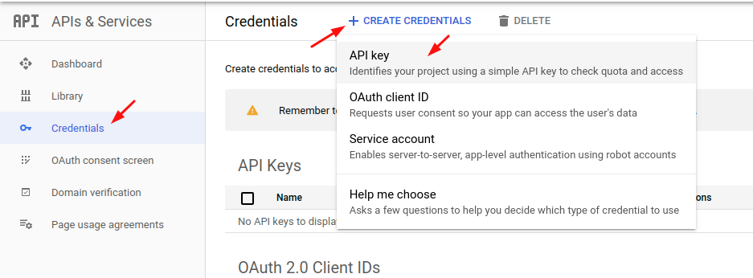

# Google Map API

## Make a Google Project and enable APIs

To use the Maps JavaScript you must have an API key. The API key is a unique identifier that is used to authenticate requests associated with your project for usage and billing purposes.

To get an API key:

1. Go to the [Google API Console](https://console.developers.google.com/).

   2. Click the project drop-down and select or create the project for which you want to add an API key.


3. Click the menu button and select **Library**.


4. Find **Maps JavaScript API** and enable it.


5. Click the menu button and select **Credentials** and click **Create credentials &gt; API key**



The **API key created** dialog displays your newly created API key.


The new API key is listed on the **Credentials** page under **API keys**.  
\(Remember to [restrict the API key](https://developers.google.com/maps/documentation/javascript/get-api-key#restrict_key) before using it in production.\) 

**6.** Copy the API Key and paste in your `.env` file. You can use the .env editor from when you login as admin

```text
GOOGLE_MAPS_API_KEY="" //API KEY
```


