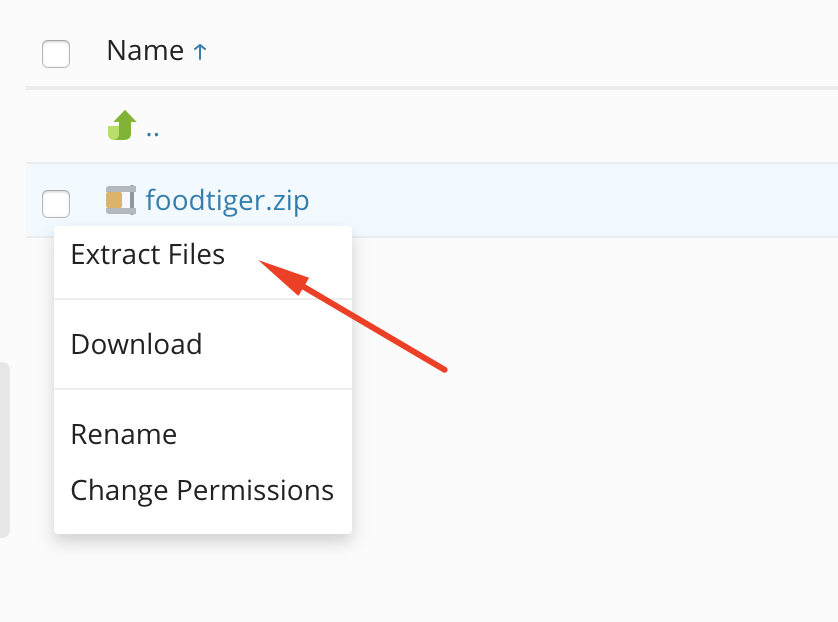
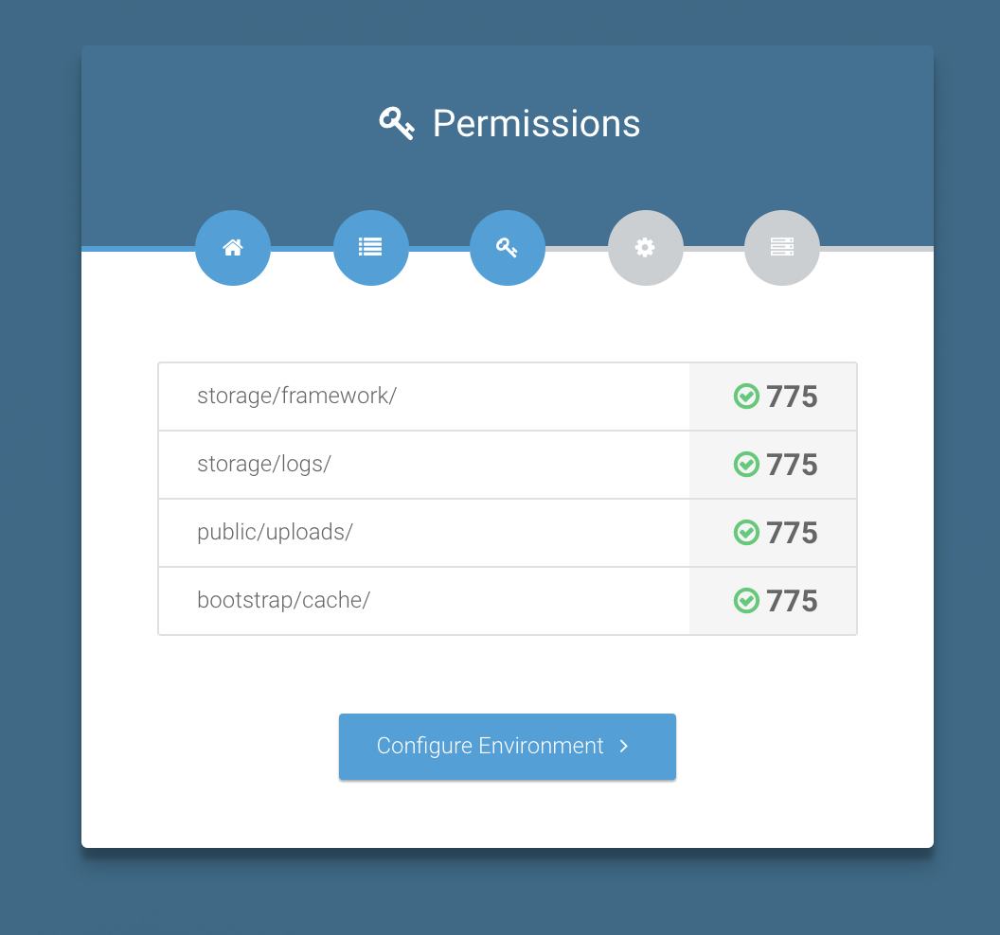
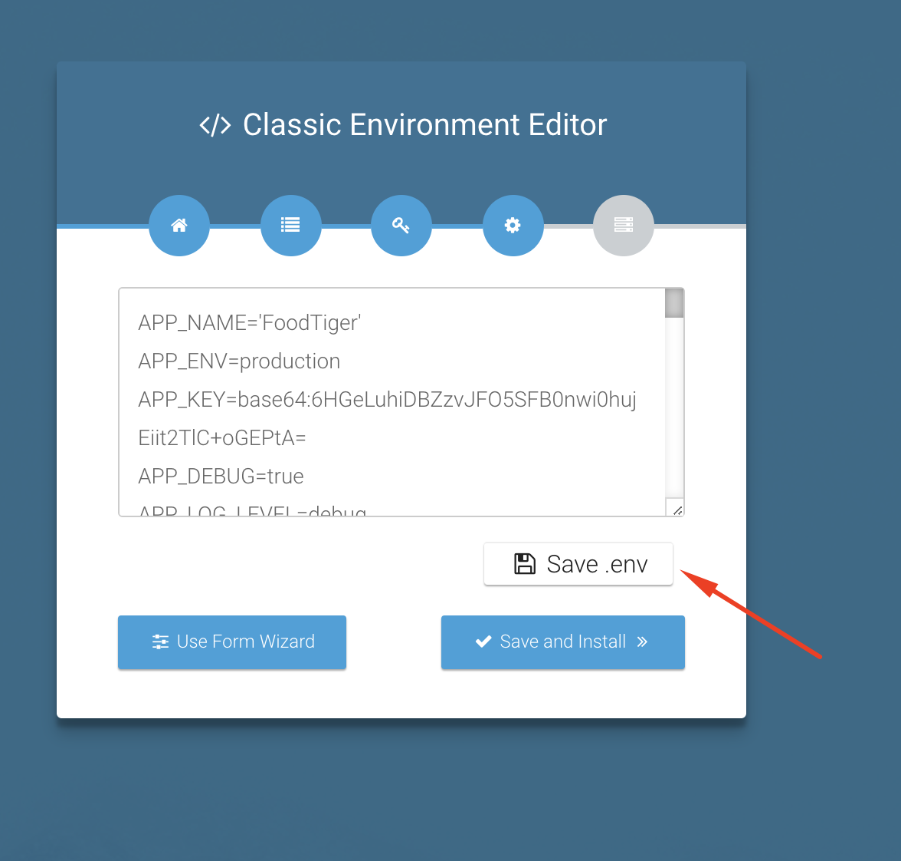

# Installation on Shared Hosting

## Requirements

QR Menu Maker is a self-hosted web application written in PHP on top of the Laravel 5.8 framework. The followings are required to install QR Menu Maker:

* PHP Version: 7.1 or higher
* MySQL Version: &gt;= 5.x
* Application server: Apache, Nginx
* IMPORTANT: The script can't be installed in subfolder. Only directly in domain or subdomain.

## Prepare to install

Installing QR Menu Maker is very easy and you'll be able to install it without any coding knowledge. Installation process included three major steps:

1. **Creating domain or subdomain**
2. **Creating database**
3. **Uploading script files to the host**
4. **Creating environment configuration**

**Now bellow you can watch the video installation tutorial or you can continue with step by step.**


**Warning:** Video installation tutorial doesn't include environment explanation. You can check that in the steps below.


## Video installation tutorial




### Installation on Shared Hosting

Plesk / cPanel and other hosting managers are recommended. In this guide we will use Plesk but similar should be for other. 

#### 1. Create your domain or subdomain in your shared hosting

After you have created that, you will be able to access the file manager for that domain/subdomain

Delete any default files that are maybe added.

#### 2. Create a database

Create an empty database in your shared hosting and remember this credentials

* db name
* db username
* db user pass

The process of making database is something like this.


#### 3.  Upload the source code you have downloaded from CodeCanyon and unzip it



#### 4. Now navigate to the web url where your project is located

ex. mydomain.com or subdomain.mydomain.com

You should be redirected to a screen like this one


Click on the "Check Requirements" If some requirements is missing it will be noted out.


Now let's check folder permissions. If some folder is noted as not writable, please check his permission. It should be 775 or 777



Now we need to setup the environment. This tells Laravel how to work.


Select the classic text editor.


**5. Environment Configuration**


**Note:** This configuration requires many steps so we will explain this more detailed.


As we already mentioned environment configuration requires many steps but just for the beginning we will need only several configurations:

* **Applications Basics** These are the first variables you will need to change.

```text
APP_NAME=Application name goes here
APP_ENV=production
APP_URL=Your website url goes here
```

* **Database Configuration** Click on the article below to continue with the database configuration.



* **Disable/Enable demo data** It's suggested to disable adding demo data in the process of installation. There is option for deleting  manually this data after the installation but as we mentioned it's not required. You can check the demo data in our demo website [here](https://QR Menu Maker.site/).   If you want to disable adding demo data the value of this variable will be **false** otherwise **true**.

```text
DEMO_DATA=true/false
```

When you finish with this configuration don't forget to save the .env file.



Click on **Save and install**

Now the install process will begin

It will install all the necessary configurations. If some error occurs, the next screen will tell you that. Take screenshot from it. Send to our [support chat](https://help.mobidonia.com/#QR Menu Maker).

If all goes okay, you can click on "Finish".

Now you have your own instance but the configuration is not over. Now you need to continue with the other environment configuration. 

After the installation is finished now the other configuration you will need to add/change directly in the .env file located in your source code.

```text
ENABLE_LOCATION_SEARCH=true
GOOGLE_MAPS_GEOCODING_API_KEY="" //your API Key
```

By default the site will not have "Location Based" results. You will need to enable them with the following env variables.   
  
Click on the article below to continue with the other configuration. Everything is explained step by step.



When you finish with the configuration we can go on the next step application usage.

Learn how to use it. 




