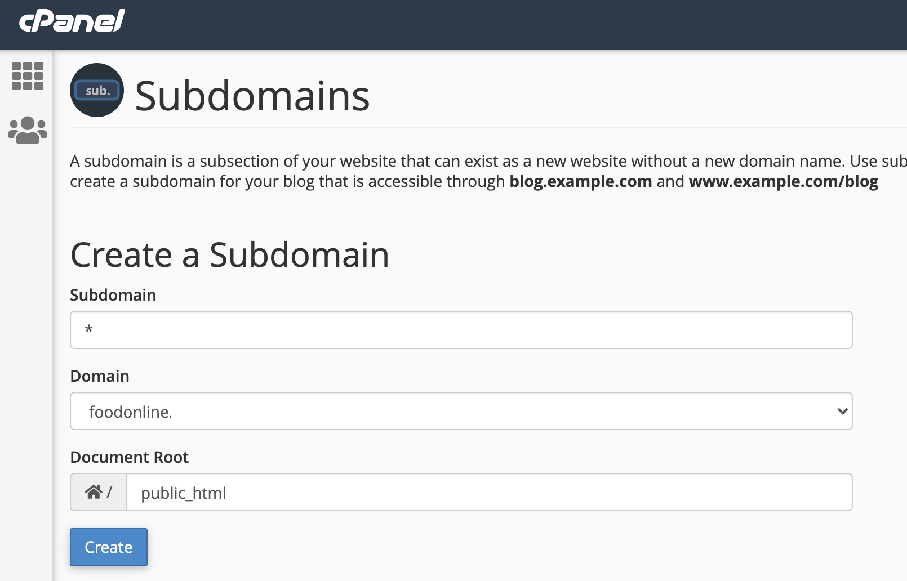
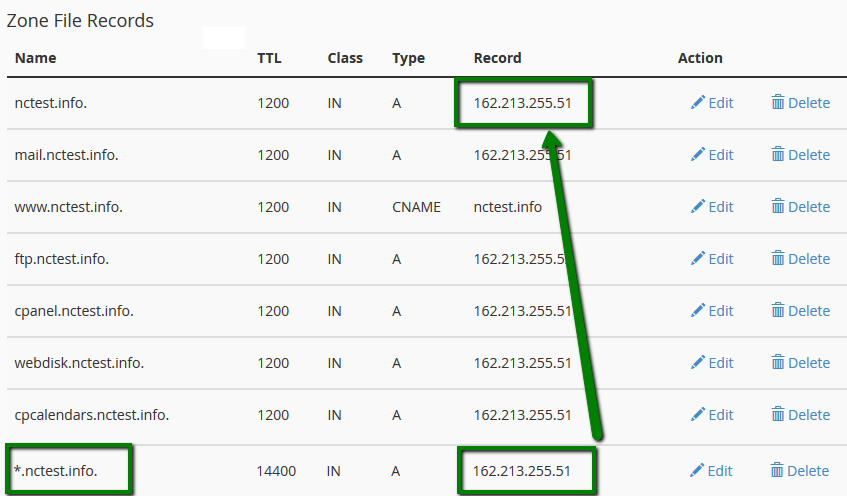

# Restaurant subdomain

## Set up wildcard subdomain

One of the most commonly used shared hosting framework is cPanel. So we will write our guide for it. But things should be similar in Plesk or any other solution.

After you have your main domain or subdomain active, and your site is up and running, you can make each restaurant to have its own domain. Like in our demo.

The main site is  [https://zebra-qr.com/](https://zebra-qr.com/)  and there you can find all restaurants as they are in subfolder ex \( [https://zebra-qr.com/restaurant/leukapizza](https://zebra-qr.com/restaurant/leukapizza) \). But each restaurant can be also directly open for example: [https://leukapizza.zebra-qr.com/](https://leukapizza.zebra-qr.com/) This feature is directly enabled in your QR Menu Maker site. But you will need to create a wildcard subdomain that uses the same folder as your main site.

1. Log into your cPanel.  
2. Navigate to **Domains** section &gt; **Subdomains** menu:

3. Create a subdomain **\***

* Enter \* for Subdomain
* Select your domain
* Select \( enter \) the same document root - in this case /public\_html

4. Go to the **Zone Editor** menu:

5. Make sure that there is an **A record** for **\*.yourdomain.com** created and pointed to the server IP address \(it could coincide with the IP address of your main domain or ftp.yourdomain.com is pointed to\):

6. Now, you will need to wait until the **propagation is over** \(it should take N seconds, where N – is **TTL** for this A record; you can edit it manually and reduce the number to speed up the process\), and then the wildcard subdomain will work correctly.

Each restaurant has automatically their own subdomain now. Open some restaurants on your site. Example:

[https://zebra-qr.com/restaurant/malibudiner](https://zebra-qr.com/restaurant/malibudiner)--&gt;   
[https://malibudiner.zebra-qr.com/](https://malibudiner.zebra-qr.com/)

In this case, the subdomain is **malibudiner**

7. Login as admin in your project and decare in Settings / Setup and select WILDCARD\_DOMAIN\_READY

Article Instructions copied from 



## **SSL - HTTPS**

By default the wildcard subdomains are not SSL protected. To do that you can buy or issue wildcard SSL certificate - sometimes they are a bit expensive. You can also use [https://letsencrypt.org/](https://letsencrypt.org/) to create your own free wildcard SSL. Plesk by default can enable SSL on wildcard subdomain. You can also use this [guide](https://medium.com/@saurabh6790/generate-wildcard-ssl-certificate-using-lets-encrypt-certbot-273e432794d7). Our demo site works on Laravel Forge. They also have the options to automatically create wildcard SSL via Digital Ocean NS.

